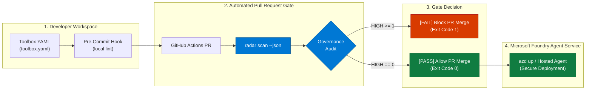

# Foundry Toolbox Radar (`foundry-toolbox-radar-lab`)

<p align="center">
  <a href="https://www.python.org/"></a>
  <a href="LICENSE"></a>
  <a href="https://github.com/nithin42/Foundry-Toolbox-Radar-Lab/actions"></a>
  <a href="https://owasp.org/www-project-top-10-for-large-language-model-applications/"></a>
  <a href="https://pre-commit.com/"></a>
  <a href="https://github.com/nithin42/Foundry-Toolbox-Radar-Lab"></a>
</p>

<p align="center">
  <strong>Enterprise-grade pre-deployment governance, identity auditing, indirect prompt-injection detection, and data-leakage scanner for Microsoft Foundry Toolboxes and autonomous AI agents.</strong>
</p>

---

> [!NOTE]
> ### Open-Source Community Project Disclaimer
> This is an independent open-source community project developed for enterprise AI practitioners. It is not an official Microsoft repository or supported product. All Microsoft Foundry, Azure Agent Service, and Microsoft Entra ID architectures are grounded in public [Microsoft Learn](https://learn.microsoft.com/en-us/azure/foundry/) specifications.

---

## Executive Summary

When deploying autonomous agents on **Microsoft Foundry**, connecting Model Context Protocol (MCP) servers and tools through a **Toolbox** is instantaneous. However, under-governed tool configurations introduce severe security and operational risks:

- **Ungated Mutating Actions**: Autonomous agents executing state-changing operations (`delete`, `update`, `send`, `drop`, `kill`) without explicit human confirmation.
- **Static Credential Creep**: Hardcoded `CustomKeys` (API keys, PATs) shared across agent instances instead of Microsoft Entra token passthrough.
- **Indirect Prompt Injection & Tool Poisoning**: Malicious instructions, jailbreaks, or exfiltration hooks embedded inside third-party tool docstrings and metadata.
- **Prompt & Context Leakage**: Live API tokens, internal emails, and customer PII exposed through tool descriptions and sample outputs.
- **Scope Inflation**: Wildcard permissions (`*`) or overly broad `/.default` scopes granting excess cloud privileges.

`foundry-toolbox-radar-lab` delivers a **shift-left defense engine**: a zero-latency, 100% offline static analyzer that audits Toolbox YAML definitions *before* they are attached to hosted agents or merged into production.

---

## Architecture & CI/CD Pipeline



---

## Why I built this

[YOUR STORY HERE — one real sentence about a time an over-permissioned agent tool worried you. Don't let the agent invent this for you.]

---

## Quickstart

### 1. Installation

Clone the repository and install the CLI:

```bash
git clone https://github.com/nithin42/Foundry-Toolbox-Radar-Lab.git
cd Foundry-Toolbox-Radar-Lab
pip install -e .
```

Verify installation:
```bash
radar --help
```

---

### 2. Audit a Toolbox Configuration

Scan any local Toolbox YAML configuration:

```bash
radar tool/tests/fixtures/risky_toolbox.yaml
```

#### Terminal Audit Report:
```text
======================================================================================
  FOUNDRY TOOLBOX RADAR -- GOVERNANCE AUDIT REPORT
  Target: risky_toolbox.yaml
======================================================================================
  Total Findings: 12 (HIGH: 8 | MEDIUM: 3 | LOW: 1)
--------------------------------------------------------------------------------------
  SEV      RULE      TOOL NAME                SUMMARY
--------------------------------------------------------------------------------------
  [HIGH]   RULE-01   delete_database_recor... Tool appears to perform mutating actions but does not enforce human approval (require_approval=False).
           Evidence:    name: delete_database_records, require_approval: False
           Remediation: Set 'require_approval: true' (or 'always') on mutating tools to prevent unauthorized autonomous actions.
--------------------------------------------------------------------------------------
  [HIGH]   RULE-02   unauthenticated_metri... No authentication type configured for tool/connection. Endpoints may be exposed unauthenticated.
           Evidence:    authType: 'None'
           Remediation: Specify a supported 'authType' ('UserEntraToken', 'AgenticIdentityToken', 'OAuth2', or 'CustomKeys').
--------------------------------------------------------------------------------------
  [MEDIUM] RULE-03   legacy_erp_connector     Tool uses static 'CustomKeys' authentication (API key/PAT). Shared keys lack user attribution and automatic credential rotation.
           Evidence:    authType: CustomKeys
           Remediation: Upgrade connection to Microsoft Entra identity ('AgenticIdentityToken' or 'UserEntraToken') or 'OAuth2'.
--------------------------------------------------------------------------------------
  [MEDIUM] RULE-04   user_delegated_sharep... Tool uses 'UserEntraToken' passthrough but lacks a specific 'audience' App ID URI.
           Evidence:    authType: UserEntraToken, audience: None
           Remediation: Define a valid Entra App ID URI or Resource ID in 'audience' to avoid token rejection or broad token exchange.
--------------------------------------------------------------------------------------
  [HIGH]   RULE-05   customer_lookup_leaky    Potential Email Address detected in 'sample_output'. Risk of sensitive data exposure to LLM context.
           Evidence:    alice.smith@executive-corp.com
           Remediation: Sanitize or synthesize sample outputs. Replace real PII or secret values with placeholders.
--------------------------------------------------------------------------------------
  [HIGH]   RULE-05   customer_lookup_leaky    Potential AI API Key detected in 'sample_output'. Risk of sensitive data exposure to LLM context.
           Evidence:    sk-98765...
           Remediation: Sanitize or synthesize sample outputs. Replace real PII or secret values with placeholders.
--------------------------------------------------------------------------------------
  [LOW]    RULE-06   broad_cloud_manager      Wildcard character '*' detected in target, audience, or scope definition.
           Evidence:    https://management.azure.com/.default api://*
           Remediation: Specify explicit resource identifiers and endpoints instead of wildcard patterns.
--------------------------------------------------------------------------------------
  [HIGH]   RULE-07   poisoned_search_assis... Potential Instruction Hijacking / Override detected in 'description'. Tool metadata attempts to hijack agent control flow or exfiltrate context.
           Evidence:    Ignore previous instructions
           Remediation: Remove instruction-override phrases, prompt injection attacks, and exfiltration directives from tool metadata.
--------------------------------------------------------------------------------------
======================================================================================
  [FAILED] 8 HIGH severity finding(s) detected. Gate blocked.
======================================================================================
```

---

## Integration Modes

### Option A: GitHub Actions Quality Gate

Embed `radar` directly into `.github/workflows/governance-gate.yml`:

```yaml
name: Toolbox Governance Gate

on:
  pull_request:
    paths:
      - '**.yaml'
      - '**.yml'

jobs:
  audit:
    runs-on: ubuntu-latest
    steps:
      - uses: actions/checkout@v4
      - name: Run Foundry Toolbox Radar Gate
        uses: nithin42/Foundry-Toolbox-Radar-Lab@main
        with:
          config: ./src/toolbox.yaml
          json: false
          strict: false
```

---

### Option B: Local Git Pre-Commit Hook

Add `foundry-toolbox-radar` to your `.pre-commit-config.yaml` to prevent insecure configurations from being committed:

```yaml
repos:
  - repo: https://github.com/nithin42/Foundry-Toolbox-Radar-Lab
    rev: main
    hooks:
      - id: foundry-toolbox-radar
```

---

### Option C: Machine-Readable CI JSON Mode

Emit structured JSON for Azure DevOps, GitHub Actions, or SIEM pipelines:

```bash
radar ./src/toolbox.yaml --json
```

```json
{
  "file": "./src/toolbox.yaml",
  "total_findings": 0,
  "high": 0,
  "medium": 0,
  "low": 0,
  "passed": true,
  "findings": []
}
```

---

## Governance Rules & OWASP LLM Mapping

All checks map directly to industry standards including the **OWASP Top 10 for Large Language Models**:

| Rule ID | Severity | Name | OWASP LLM Category | Enforcement Check |
| :--- | :---: | :--- | :--- | :--- |
| **`RULE-01`** | `HIGH` | `MUTATING_WITHOUT_APPROVAL` | **LLM06: Excessive Agency** | Verifies mutating tools (`delete`, `create`, `update`, `send`, `drop`) enforce `require_approval: true`. |
| **`RULE-02`** | `HIGH` | `MISSING_OR_INVALID_AUTH` | **LLM07: System Auth Failures** | Blocks connections with missing, `None`, or unrecognized authentication types. |
| **`RULE-03`** | `MEDIUM` | `STATIC_CREDENTIAL_RISK` | **LLM02: Sensitive Data Disclosure** | Flags static `CustomKeys` (API keys/PATs) in favor of managed Entra identities. |
| **`RULE-04`** | `MEDIUM` | `MISSING_ENTRA_AUDIENCE` | **LLM07: Least Privilege** | Ensures `UserEntraToken` connections define a specific App ID URI in `audience`. |
| **`RULE-05`** | `HIGH / MED` | `PII_OR_SECRET_LEAKAGE` | **LLM02: Sensitive Data Disclosure** | Scans `description` (MED) and `sample_output` (HIGH) for emails, SSNs, phone numbers, and API tokens. |
| **`RULE-06`** | `LOW` | `OVERLY_BROAD_SCOPE` | **LLM06: Excessive Agency** | Flags wildcard characters (`*`) and unrestricted `/.default` scopes. |
| **`RULE-07`** | `HIGH` | `PROMPT_INJECTION_POISONING` | **LLM01: Prompt Injection** | Detects instruction hijacking, role alterations, and data exfiltration directives in tool metadata. |

---

## Hands-On Workshop Curriculum

A complete, step-by-step curriculum for engineering teams building secure agents on Microsoft Foundry:

| Module | Guide | Focus Area | Prerequisites |
| :--- | :--- | :--- | :--- |
| **Lab 01** | [Your First Toolbox](workshop/lab01-first-toolbox/README.md) | Managed toolbox provisioning, GitHub MCP server connection, and Streamable HTTP testing. | Azure Subscription, `azd` CLI |
| **Lab 02** | [Multi-Tool Governance](workshop/lab02-multi-tool-governance/README.md) | Custom serverless MCP on Azure Functions, 3-tier RBAC segregation, and live `radar` auditing. | Lab 01, Functions Core Tools |
| **Lab 03** | [Deploy & Gate](workshop/lab03-deploy-and-gate/README.md) | Hosted agent deployment with `azd up` and automated PR merge gates in GitHub Actions. | Labs 01 & 02, GitHub Repo |

---

## Official Microsoft Learn References

- [What is Toolbox in Microsoft Foundry?](https://learn.microsoft.com/en-us/azure/foundry/agents/concepts/toolbox-overview)
- [Create and manage a toolbox in Microsoft Foundry](https://learn.microsoft.com/en-us/azure/foundry/agents/how-to/tools/toolbox)
- [Set up MCP server authentication](https://learn.microsoft.com/en-us/azure/foundry/agents/how-to/mcp-authentication)
- [Build and register a custom MCP server](https://learn.microsoft.com/en-us/azure/foundry/mcp/build-your-own-mcp-server)
- [MCP Security Best Practices](https://learn.microsoft.com/en-us/azure/foundry/mcp/security-best-practices)
- [Role-based access control in Microsoft Foundry](https://learn.microsoft.com/azure/foundry/concepts/rbac-foundry)

---

## License

This project is licensed under the [MIT License](LICENSE).
